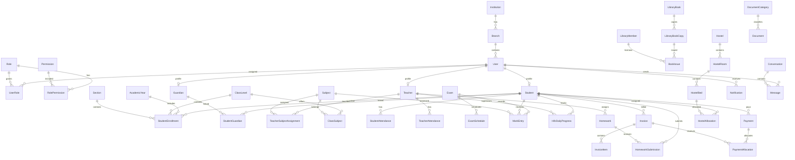

# MASTER_SPECIFICATION.md

# Enterprise Madrasah Management System

Technology Stack:

- Django 5+
- PostgreSQL
- Django REST Framework
- Bootstrap 5

---

## 1. Project Folder Structure

```text
madrasah_management/
├── manage.py
├── requirements/
│   ├── base.txt
│   ├── local.txt
│   └── production.txt
├── config/
│   ├── __init__.py
│   ├── settings/
│   │   ├── __init__.py
│   │   ├── base.py
│   │   ├── local.py
│   │   └── production.py
│   ├── urls.py
│   ├── asgi.py
│   └── wsgi.py
├── apps/
│   ├── accounts/
│   ├── rbac/
│   ├── students/
│   ├── guardians/
│   ├── teachers/
│   ├── academics/
│   ├── admission/
│   ├── attendance/
│   ├── exams/
│   ├── hifz/
│   ├── homework/
│   ├── lesson_reports/
│   ├── finance/
│   ├── notices/
│   ├── messaging/
│   ├── notifications/
│   ├── library/
│   ├── hostel/
│   ├── documents/
│   ├── website/
│   ├── reports/
│   └── common/
├── templates/
│   ├── base/
│   ├── dashboards/
│   ├── public/
│   └── emails/
├── static/
│   ├── css/
│   ├── js/
│   ├── img/
│   └── vendor/
├── media/
│   ├── students/
│   ├── guardians/
│   ├── teachers/
│   ├── documents/
│   └── website/
├── locale/
├── scripts/
├── docs/
│   └── MASTER_SPECIFICATION.md
└── tests/
```

---

## 2. App Structure

Each Django app follows the same enterprise structure:

```text
app_name/
├── __init__.py
├── admin.py
├── apps.py
├── models.py
├── managers.py
├── selectors.py
├── services.py
├── permissions.py
├── serializers.py
├── views.py
├── urls.py
├── filters.py
├── forms.py
├── tasks.py
├── signals.py
├── constants.py
├── validators.py
├── tests/
│   ├── test_models.py
│   ├── test_services.py
│   ├── test_api.py
│   └── test_permissions.py
└── migrations/
```

Purpose:

- `models.py`: database entities only
- `services.py`: business workflows
- `selectors.py`: read/query logic
- `permissions.py`: app-level access rules
- `serializers.py`: DRF serialization
- `views.py`: API and web views
- `tasks.py`: async/background jobs
- `signals.py`: lightweight event hooks
- `constants.py`: choices and fixed values
- `validators.py`: reusable validation rules

---

## 3. Database Schema

Core schema groups:

```text
accounts
rbac
students
guardians
teachers
academics
admission
attendance
exams
hifz
homework
lesson_reports
finance
notices
messaging
notifications
library
hostel
documents
website
reports
common
```

Primary database principles:

- PostgreSQL UUID primary keys for all major business entities
- Soft delete support for operational records
- Full audit metadata on important records
- Foreign keys use protective deletion where financial, academic, or legal history matters
- Historical records are immutable where applicable
- Status fields use controlled choices
- Indexes on tenant, academic year, student, class, section, date, status, and payment references
- Unique constraints for roll numbers, admission numbers, invoice numbers, receipt numbers, employee IDs, and library accession numbers

---

## 4. Models

### Common

- Institution
- Branch
- AcademicYear
- SystemSetting
- AuditLog
- Attachment
- Address
- ContactInfo
- BaseStatusLog

### Accounts

- User
- UserProfile
- LoginHistory
- PasswordResetRequest
- UserSession
- UserDevice
- AccountVerification

### RBAC

- Role
- Permission
- RolePermission
- UserRole
- Module
- Feature
- AccessPolicy

### Students

- Student
- StudentProfile
- StudentEnrollment
- StudentClassHistory
- StudentStatusHistory
- StudentDocument
- StudentMedicalInfo
- StudentPreviousEducation

### Guardians

- Guardian
- StudentGuardian
- GuardianContactPreference

### Teachers

- Teacher
- TeacherProfile
- TeacherEmployment
- TeacherSubjectAssignment
- TeacherClassAssignment
- TeacherDocument

### Academics

- ClassLevel
- Section
- Subject
- Syllabus
- Curriculum
- ClassSubject
- Period
- Timetable
- TimetableSlot
- Room
- AcademicCalendar
- Holiday

### Admission

- AdmissionApplication
- AdmissionApplicant
- AdmissionTest
- AdmissionTestResult
- AdmissionInterview
- AdmissionDecision
- AdmissionOffer
- AdmissionEnrollment

### Attendance

- StudentAttendance
- StudentAttendanceSession
- TeacherAttendance
- StaffAttendance
- LeaveRequest
- AttendanceCorrectionRequest

### Exams

- Exam
- ExamTerm
- ExamSchedule
- ExamSubject
- ExamSeatPlan
- MarkEntry
- GradeScale
- GradeRule
- Result
- ResultSubject
- Transcript
- PromotionDecision

### Hifz Progress

- HifzEnrollment
- HifzDailyProgress
- HifzRevision
- HifzMistake
- HifzTarget
- HifzEvaluation
- HifzTeacherAssignment

### Homework

- Homework
- HomeworkAttachment
- HomeworkSubmission
- HomeworkReview

### Daily Lesson Reports

- DailyLessonReport
- LessonReportTopic
- LessonReportStudentNote
- LessonReportAttachment

### Fees

- FeeCategory
- FeeType
- FeeStructure
- FeeStructureItem
- StudentFeeAssignment
- Invoice
- InvoiceItem
- Discount
- StudentDiscount
- FineRule
- Fine

### Payments

- Payment
- PaymentAllocation
- PaymentMethod
- PaymentGatewayTransaction
- Receipt
- Refund
- FinancialAccount
- LedgerEntry

### Notices

- Notice
- NoticeAudience
- NoticeAttachment
- NoticeReadStatus

### Messaging

- Conversation
- ConversationParticipant
- Message
- MessageAttachment
- MessageReadStatus

### Notifications

- Notification
- NotificationTemplate
- NotificationPreference
- NotificationDeliveryLog

### Library

- LibraryBook
- LibraryBookCopy
- LibraryAuthor
- LibraryPublisher
- LibraryCategory
- LibraryMember
- BookIssue
- BookReturn
- LibraryFine
- BookReservation

### Hostel

- Hostel
- HostelBlock
- HostelFloor
- HostelRoom
- HostelBed
- HostelAllocation
- HostelAttendance
- HostelLeaveRequest
- HostelFee

### Documents

- DocumentCategory
- Document
- DocumentOwner
- DocumentVerification
- DocumentAccessLog

### Public Website

- WebsitePage
- WebsiteMenu
- WebsitePost
- WebsiteEvent
- WebsiteGallery
- WebsiteSlider
- WebsiteNotice
- WebsiteContactMessage

### Reports & Analytics

- ReportDefinition
- SavedReport
- ReportExport
- AnalyticsSnapshot
- DashboardWidget
- KPIRecord

---

## 5. Model Fields

## Reusable Fields

Used across most models:

| Field | Type | Description |
|---|---|---|
| id | UUID | Primary key |
| institution | FK | Institution ownership |
| branch | FK | Branch ownership |
| created_at | DateTime | Creation timestamp |
| updated_at | DateTime | Last update timestamp |
| created_by | FK User | Creator |
| updated_by | FK User | Last updater |
| is_active | Boolean | Active flag |
| is_deleted | Boolean | Soft delete flag |
| deleted_at | DateTime | Soft delete timestamp |
| deleted_by | FK User | Soft delete actor |

---

## Core Model Fields

### Institution

| Field | Type |
|---|---|
| name | Char |
| code | Char, unique |
| registration_number | Char |
| logo | Image |
| email | Email |
| phone | Char |
| address | Text |
| website | URL |
| established_date | Date |
| timezone | Char |
| default_language | Char |
| status | Choice |

### Branch

| Field | Type |
|---|---|
| institution | FK Institution |
| name | Char |
| code | Char |
| address | Text |
| phone | Char |
| email | Email |
| head | FK User |
| status | Choice |

### User

| Field | Type |
|---|---|
| username | Char, unique |
| email | Email, unique |
| phone | Char |
| first_name | Char |
| last_name | Char |
| password | Char |
| user_type | Choice |
| photo | Image |
| is_staff | Boolean |
| is_superuser | Boolean |
| is_active | Boolean |
| last_login | DateTime |

### Role

| Field | Type |
|---|---|
| name | Char |
| code | Char, unique |
| description | Text |
| scope | Choice |
| priority | Integer |
| is_system_role | Boolean |

### Permission

| Field | Type |
|---|---|
| module | FK Module |
| feature | FK Feature |
| action | Choice |
| code | Char, unique |
| description | Text |

### Student

| Field | Type |
|---|---|
| user | OneToOne User |
| admission_number | Char, unique |
| student_id | Char, unique |
| current_enrollment | FK StudentEnrollment |
| date_of_birth | Date |
| gender | Choice |
| blood_group | Choice |
| photo | Image |
| status | Choice |
| admission_date | Date |

### StudentEnrollment

| Field | Type |
|---|---|
| student | FK Student |
| academic_year | FK AcademicYear |
| class_level | FK ClassLevel |
| section | FK Section |
| roll_number | Char |
| enrollment_status | Choice |
| start_date | Date |
| end_date | Date |

Unique:

- academic_year + class_level + section + roll_number
- student + academic_year

### Guardian

| Field | Type |
|---|---|
| user | OneToOne User |
| guardian_id | Char, unique |
| occupation | Char |
| national_id | Char |
| relationship_label | Char |
| photo | Image |
| status | Choice |

### StudentGuardian

| Field | Type |
|---|---|
| student | FK Student |
| guardian | FK Guardian |
| relationship | Choice |
| is_primary | Boolean |
| can_pickup | Boolean |
| receives_sms | Boolean |
| receives_email | Boolean |

### Teacher

| Field | Type |
|---|---|
| user | OneToOne User |
| employee_id | Char, unique |
| teacher_type | Choice |
| joining_date | Date |
| qualification | Text |
| specialization | Char |
| status | Choice |

### ClassLevel

| Field | Type |
|---|---|
| name | Char |
| code | Char |
| order | Integer |
| education_stream | Choice |
| status | Choice |

### Section

| Field | Type |
|---|---|
| class_level | FK ClassLevel |
| name | Char |
| capacity | Integer |
| class_teacher | FK Teacher |
| status | Choice |

### Subject

| Field | Type |
|---|---|
| name | Char |
| code | Char |
| subject_type | Choice |
| is_hifz_subject | Boolean |
| status | Choice |

### Attendance

| Field | Type |
|---|---|
| student | FK Student |
| class_level | FK ClassLevel |
| section | FK Section |
| date | Date |
| session | Choice |
| status | Choice |
| marked_by | FK User |
| remarks | Text |

Unique:

- student + date + session

### Exam

| Field | Type |
|---|---|
| name | Char |
| academic_year | FK AcademicYear |
| exam_term | FK ExamTerm |
| class_level | FK ClassLevel |
| start_date | Date |
| end_date | Date |
| status | Choice |

### MarkEntry

| Field | Type |
|---|---|
| exam | FK Exam |
| student | FK Student |
| subject | FK Subject |
| marks_obtained | Decimal |
| practical_marks | Decimal |
| written_marks | Decimal |
| total_marks | Decimal |
| grade | Char |
| remarks | Text |
| entered_by | FK User |
| approved_by | FK User |
| status | Choice |

### HifzDailyProgress

| Field | Type |
|---|---|
| student | FK Student |
| teacher | FK Teacher |
| date | Date |
| sabaq | Char |
| sabqi | Char |
| manzil | Char |
| juz | Integer |
| page_from | Integer |
| page_to | Integer |
| quality | Choice |
| mistakes_count | Integer |
| remarks | Text |

### Invoice

| Field | Type |
|---|---|
| student | FK Student |
| invoice_number | Char, unique |
| academic_year | FK AcademicYear |
| issue_date | Date |
| due_date | Date |
| subtotal | Decimal |
| discount_total | Decimal |
| fine_total | Decimal |
| payable_total | Decimal |
| paid_total | Decimal |
| balance | Decimal |
| status | Choice |

### Payment

| Field | Type |
|---|---|
| student | FK Student |
| payment_number | Char, unique |
| amount | Decimal |
| payment_date | DateTime |
| method | FK PaymentMethod |
| transaction_reference | Char |
| received_by | FK User |
| status | Choice |

### LibraryBook

| Field | Type |
|---|---|
| title | Char |
| isbn | Char |
| category | FK LibraryCategory |
| publisher | FK LibraryPublisher |
| language | Char |
| edition | Char |
| publication_year | Integer |
| status | Choice |

### LibraryBookCopy

| Field | Type |
|---|---|
| book | FK LibraryBook |
| accession_number | Char, unique |
| barcode | Char |
| shelf_location | Char |
| condition | Choice |
| availability_status | Choice |

### HostelAllocation

| Field | Type |
|---|---|
| student | FK Student |
| hostel | FK Hostel |
| room | FK HostelRoom |
| bed | FK HostelBed |
| start_date | Date |
| end_date | Date |
| status | Choice |

### Document

| Field | Type |
|---|---|
| category | FK DocumentCategory |
| title | Char |
| file | File |
| document_type | Choice |
| owner_type | Choice |
| owner_id | UUID |
| verification_status | Choice |
| uploaded_by | FK User |

---

## 6. Relationships

Primary relationships:

- Institution has many Branches
- Branch has many Users, Students, Teachers, Classes, Hostel records, Library records
- User has one optional Student, Guardian, or Teacher profile
- User has many Roles through UserRole
- Role has many Permissions through RolePermission
- Student belongs to one current Enrollment
- Student has many historical Enrollments
- Student has many Guardians through StudentGuardian
- Guardian may be linked to many Students
- Teacher may teach many Subjects and Classes
- ClassLevel has many Sections
- ClassLevel has many Subjects through ClassSubject
- Section has many Students through StudentEnrollment
- Student has many Attendance records
- Student has many Exam Results
- Student has many Hifz Progress records
- Student has many Invoices and Payments
- Invoice has many InvoiceItems
- Payment may be allocated to many Invoices
- LibraryMember links User to Library operations
- HostelAllocation links Student to HostelRoom and HostelBed
- Documents may belong to Student, Guardian, Teacher, Staff, AdmissionApplication, Invoice, or Institution
- Notifications may target User, Role, Class, Section, Student, Guardian, or custom audience

---

## 7. ERD



---

## 8. Permission Matrix

Actions:

- View
- Create
- Update
- Delete
- Approve
- Export
- Manage

| Module | Super Admin | Admin | Principal | Vice Principal | Teacher | Hifz Teacher | Accountant | Admission Officer | Hostel Manager | Library Manager | Student | Guardian |
|---|---|---|---|---|---|---|---|---|---|---|---|---|
| Accounts | Manage | Manage | View | View | Own | Own | Own | Own | Own | Own | Own | Own |
| RBAC | Manage | Manage | View | None | None | None | None | None | None | None | None | None |
| Students | Manage | Manage | View/Update | View/Update | View Assigned | View Assigned | View Billing | Create/View | View Hostel | View Library | Own | Child |
| Guardians | Manage | Manage | View | View | View Assigned | View Assigned | View Billing | Create/View | View | View | None | Own |
| Teachers | Manage | Manage | View/Update | View/Update | Own | Own | View | None | None | None | None | None |
| Academics | Manage | Manage | Approve | Manage | View Assigned | View Assigned | None | View | None | None | View | View |
| Admission | Manage | Manage | Approve | Review | None | None | View Fees | Manage | None | None | Apply/View | Apply/View |
| Attendance | Manage | Manage | View/Approve | View/Approve | Mark Assigned | Mark Hifz | None | None | Hostel Attendance | None | Own | Child |
| Exams | Manage | Manage | Approve | Manage | Mark Assigned | Mark Hifz | None | None | None | None | Own Result | Child Result |
| Hifz Progress | Manage | Manage | View | View | View Assigned | Manage Assigned | None | None | None | None | Own | Child |
| Homework | Manage | Manage | View | View | Manage Assigned | Manage Assigned | None | None | None | None | Submit/View | Child View |
| Lesson Reports | Manage | Manage | View | View | Create Assigned | Create Assigned | None | None | None | None | View | Child View |
| Fees | Manage | Manage | View | View | None | None | Manage | View | View Hostel Fee | None | Own | Child |
| Payments | Manage | Manage | View | View | None | None | Manage | View | View | None | Own | Child |
| Notices | Manage | Manage | Approve | Create | Create Limited | Create Limited | Create Limited | Create Limited | Create Limited | Create Limited | View | View |
| Messaging | Manage | Manage | Manage | Manage | Assigned | Assigned | Billing Related | Admission Related | Hostel Related | Library Related | Own | Child Related |
| Notifications | Manage | Manage | Manage | Manage | Send Assigned | Send Assigned | Send Billing | Send Admission | Send Hostel | Send Library | Receive | Receive |
| Library | Manage | Manage | View | View | Borrow/View | Borrow/View | None | None | None | Manage | Borrow/View | Child View |
| Hostel | Manage | Manage | View | View | None | None | View Fees | None | Manage | None | Own | Child |
| Documents | Manage | Manage | View | View | Own/Assigned | Own/Assigned | Finance Docs | Admission Docs | Hostel Docs | Library Docs | Own | Child |
| Website | Manage | Manage | Approve | Review | Create Limited | Create Limited | None | Admission Content | Hostel Content | Library Content | View | View |
| Reports | Manage | Manage | View All | View Academic | Assigned Reports | Hifz Reports | Finance Reports | Admission Reports | Hostel Reports | Library Reports | Own | Child |

---

## 9. URL Structure

### Web URLs

```text
/
├── about/
├── admissions/
├── notices/
├── events/
├── gallery/
├── contact/
├── login/
├── logout/
├── dashboard/
├── accounts/
├── rbac/
├── students/
├── guardians/
├── teachers/
├── academics/
├── admission/
├── attendance/
├── exams/
├── hifz/
├── homework/
├── lesson-reports/
├── finance/
│   ├── fees/
│   ├── invoices/
│   ├── payments/
│   └── reports/
├── notices/
├── messaging/
├── notifications/
├── library/
├── hostel/
├── documents/
├── website/
└── reports/
```

### Role Dashboard URLs

```text
/dashboard/super-admin/
/dashboard/admin/
/dashboard/principal/
/dashboard/vice-principal/
/dashboard/teacher/
/dashboard/hifz-teacher/
/dashboard/accountant/
/dashboard/admission-officer/
/dashboard/hostel-manager/
/dashboard/library-manager/
/dashboard/student/
/dashboard/guardian/
```

---

## 10. API Structure

Base path:

```text
/api/v1/
```

API groups:

```text
/api/v1/auth/
/api/v1/accounts/
/api/v1/rbac/
/api/v1/students/
/api/v1/guardians/
/api/v1/teachers/
/api/v1/academics/
/api/v1/admission/
/api/v1/attendance/
/api/v1/exams/
/api/v1/hifz/
/api/v1/homework/
/api/v1/lesson-reports/
/api/v1/fees/
/api/v1/payments/
/api/v1/notices/
/api/v1/messaging/
/api/v1/notifications/
/api/v1/library/
/api/v1/hostel/
/api/v1/documents/
/api/v1/website/
/api/v1/reports/
```

Standard REST endpoints per resource:

```text
GET    /resource/
POST   /resource/
GET    /resource/{id}/
PATCH  /resource/{id}/
DELETE /resource/{id}/
POST   /resource/{id}/approve/
POST   /resource/{id}/reject/
POST   /resource/{id}/archive/
GET    /resource/export/
```

Important API endpoints:

```text
/api/v1/auth/login/
/api/v1/auth/logout/
/api/v1/auth/refresh/
/api/v1/auth/me/

/api/v1/students/{id}/guardians/
/api/v1/students/{id}/attendance/
/api/v1/students/{id}/results/
/api/v1/students/{id}/fees/
/api/v1/students/{id}/hifz-progress/
/api/v1/students/{id}/documents/

/api/v1/teachers/{id}/classes/
/api/v1/teachers/{id}/subjects/
/api/v1/teachers/{id}/timetable/

/api/v1/admission/applications/{id}/approve/
/api/v1/admission/applications/{id}/reject/
/api/v1/admission/applications/{id}/convert-to-student/

/api/v1/exams/{id}/publish-results/
/api/v1/exams/{id}/lock-marks/

/api/v1/fees/invoices/{id}/pay/
/api/v1/payments/{id}/receipt/

/api/v1/reports/dashboard/
/api/v1/reports/finance/
/api/v1/reports/academic/
/api/v1/reports/attendance/
/api/v1/reports/hifz/
```

API standards:

- Token-based authentication
- Role-aware permissions
- Pagination on list endpoints
- Filtering by academic year, branch, class, section, date range, status
- Export support for CSV, XLSX, PDF
- Consistent response envelope
- Consistent error format
- Audit logging for create, update, delete, approve, payment, and result publishing actions

---

## 11. Dashboard Structure

### Super Admin Dashboard

- Institution summary
- Branch overview
- User and role management
- System health
- Subscription or license status
- Global audit logs
- Cross-branch reports

### Admin Dashboard

- Student count
- Teacher count
- Admission pipeline
- Attendance summary
- Fee collection summary
- Notice and message center
- Pending approvals
- Operational alerts

### Principal Dashboard

- Academic performance
- Attendance trends
- Exam result overview
- Teacher activity
- Hifz progress summary
- Admission summary
- Pending approvals
- Reports shortcut

### Vice Principal Dashboard

- Class-wise academic activity
- Attendance monitoring
- Daily lesson reports
- Homework tracking
- Exam preparation status
- Teacher assignments

### Teacher Dashboard

- Assigned classes
- Assigned subjects
- Today’s timetable
- Attendance marking
- Homework management
- Lesson reports
- Exam mark entry
- Student notes

### Hifz Teacher Dashboard

- Assigned Hifz students
- Daily sabaq tracking
- Revision tracking
- Mistake trends
- Target completion
- Hifz evaluation records

### Accountant Dashboard

- Today’s collection
- Pending invoices
- Overdue fees
- Discounts and fines
- Payment methods
- Receipts
- Financial reports

### Admission Officer Dashboard

- New applications
- Application status board
- Admission tests
- Interviews
- Offers
- Enrollment conversion
- Admission reports

### Hostel Manager Dashboard

- Hostel occupancy
- Room and bed availability
- Hostel attendance
- Hostel leave requests
- Hostel fees
- Student allocation records

### Library Manager Dashboard

- Book inventory
- Issued books
- Overdue books
- Reservations
- Library fines
- Member activity

### Student Dashboard

- Profile
- Attendance
- Timetable
- Homework
- Exam results
- Hifz progress
- Fee invoices
- Notices
- Messages
- Library status

### Guardian Dashboard

- Children overview
- Attendance
- Academic results
- Hifz progress
- Homework
- Fee invoices and payments
- Notices
- Messages
- Documents

---

## 12. Naming Conventions

### Project

- Project package: `config`
- Apps package: `apps`
- App names: lowercase plural or domain terms
- URL names: kebab-case
- Python modules: snake_case
- Model classes: PascalCase
- Service classes: PascalCase with `Service` suffix
- Selector classes/functions: noun-based with `Selector` suffix where class-based
- Serializers: PascalCase with `Serializer` suffix
- ViewSets: PascalCase with `ViewSet` suffix
- Permissions: PascalCase with `Permission` suffix
- Constants: UPPER_SNAKE_CASE
- Database tables: `app_model`
- API paths: kebab-case
- Template folders: app/module based

### Examples

```text
StudentEnrollment
StudentEnrollmentSerializer
StudentEnrollmentViewSet
StudentEnrollmentService
student-enrollments
students/student_detail.html
```

### Status Choices

Standard status names:

```text
draft
pending
active
inactive
approved
rejected
archived
cancelled
completed
published
locked
deleted
```

---

## 13. Reusable Base Models

### TimeStampedModel

Fields:

- `created_at`
- `updated_at`

Purpose:

- Applied to all models requiring timestamps

### UUIDModel

Fields:

- `id`

Purpose:

- UUID primary key for enterprise-safe distributed records

### SoftDeleteModel

Fields:

- `is_deleted`
- `deleted_at`
- `deleted_by`

Purpose:

- Prevent accidental loss of operational history

### ActiveStatusModel

Fields:

- `is_active`

Purpose:

- Enable/disable records without deletion

### AuditModel

Fields:

- `created_by`
- `updated_by`

Purpose:

- Track actor ownership for business records

### InstitutionScopedModel

Fields:

- `institution`
- `branch`

Purpose:

- Multi-branch, institution-level data separation

### ApprovalModel

Fields:

- `approval_status`
- `approved_by`
- `approved_at`
- `rejected_by`
- `rejected_at`
- `rejection_reason`

Purpose:

- Workflows requiring principal, admin, or finance approval

### PublishableModel

Fields:

- `is_published`
- `published_at`
- `published_by`

Purpose:

- Notices, website content, exam results, public documents

### LockableModel

Fields:

- `is_locked`
- `locked_at`
- `locked_by`

Purpose:

- Exam marks, invoices, financial ledgers, finalized reports

---

## 14. Service Layer Design

Business logic must live in service classes/functions, not directly in views or serializers.

### Service Layer Rules

- Views handle request/response only
- Serializers validate API payload shape
- Services execute business workflows
- Selectors handle optimized read queries
- Services must use database transactions for multi-step workflows
- Services must create audit logs for sensitive actions
- Financial and exam publishing services must be idempotent where possible
- Permission checks happen before service execution
- Services return domain objects or structured result objects
- Services should avoid direct HTTP concepts

### Core Services

### Accounts

- UserCreationService
- UserActivationService
- PasswordResetService
- LoginAuditService

### RBAC

- RoleAssignmentService
- PermissionSyncService
- AccessPolicyEvaluationService

### Students

- StudentAdmissionConversionService
- StudentEnrollmentService
- StudentPromotionService
- StudentTransferService
- StudentStatusService

### Guardians

- GuardianLinkingService
- GuardianNotificationPreferenceService

### Teachers

- TeacherAssignmentService
- TeacherWorkloadService
- TeacherStatusService

### Academics

- TimetableGenerationService
- AcademicCalendarService
- CurriculumAssignmentService
- SubjectAssignmentService

### Admission

- ApplicationSubmissionService
- AdmissionReviewService
- AdmissionTestService
- AdmissionDecisionService
- AdmissionEnrollmentService

### Attendance

- StudentAttendanceMarkingService
- TeacherAttendanceService
- AttendanceCorrectionService
- AttendanceReportService

### Exams

- ExamCreationService
- ExamScheduleService
- MarkEntryService
- ResultCalculationService
- ResultPublishService
- PromotionDecisionService

### Hifz

- HifzProgressRecordingService
- HifzTargetService
- HifzEvaluationService
- HifzReportService

### Homework

- HomeworkAssignmentService
- HomeworkSubmissionService
- HomeworkReviewService

### Lesson Reports

- DailyLessonReportService
- LessonReportApprovalService

### Finance

- FeeStructureService
- InvoiceGenerationService
- DiscountApplicationService
- FineCalculationService
- PaymentProcessingService
- ReceiptGenerationService
- RefundService
- LedgerPostingService

### Notices

- NoticePublishingService
- NoticeAudienceService
- NoticeReadTrackingService

### Messaging

- ConversationService
- MessageDeliveryService
- MessageReadTrackingService

### Notifications

- NotificationDispatchService
- NotificationTemplateService
- NotificationPreferenceService

### Library

- BookInventoryService
- BookIssueService
- BookReturnService
- LibraryFineService
- BookReservationService

### Hostel

- HostelAllocationService
- HostelAttendanceService
- HostelLeaveService
- HostelFeeService

### Documents

- DocumentUploadService
- DocumentVerificationService
- DocumentAccessService

### Website

- PagePublishingService
- WebsiteMenuService
- PublicNoticeService
- ContactMessageService

### Reports

- DashboardAnalyticsService
- ReportGenerationService
- ExportService
- KPIAggregationService

---

## 15. Deployment Architecture

### Recommended Production Architecture

```text
Client Browser
    |
    v
Nginx Reverse Proxy
    |
    v
Gunicorn / ASGI Application Layer
    |
    v
Django 5 Application
    |
    ├── PostgreSQL Database
    ├── Redis Cache / Message Broker
    ├── Celery Worker
    ├── Celery Beat Scheduler
    ├── Object/File Storage
    └── Email/SMS/Push Providers
```

### Components

| Component | Purpose |
|---|---|
| Nginx | TLS termination, static/media routing, reverse proxy |
| Gunicorn | WSGI application server |
| ASGI Server | WebSocket or async notification support if required |
| PostgreSQL | Primary relational database |
| Redis | Cache, sessions, Celery broker |
| Celery Worker | Background jobs |
| Celery Beat | Scheduled jobs |
| Object Storage | Documents, photos, exports |
| SMTP Provider | Email delivery |
| SMS Gateway | Guardian and student SMS alerts |
| Monitoring | Logs, uptime, errors, performance |
| Backup Service | Database and media backup |

### Deployment Environments

```text
local
staging
production
```

### Production Requirements

- Environment-based settings
- HTTPS only
- Secure cookies
- CSRF protection
- CORS whitelist
- Database connection pooling
- Static file compression
- Media file protection for private documents
- Automated backups
- Centralized logging
- Error tracking
- Health check endpoint
- Role-based audit logs
- Database migrations through controlled release process

### Background Jobs

Scheduled jobs:

- Daily attendance summary
- Fee due reminders
- Overdue invoice fines
- Library overdue fines
- Hostel attendance reports
- Exam result snapshots
- Notification retries
- Database backup trigger
- Analytics aggregation

### Scaling Strategy

- Separate web, worker, scheduler, database, cache, and storage layers
- Horizontal scaling for web workers
- Dedicated Celery queues for finance, notifications, reports, and exports
- Read replicas for analytics if required
- CDN for public website static/media assets
- Partition or archive old attendance, messages, logs, and analytics records over time